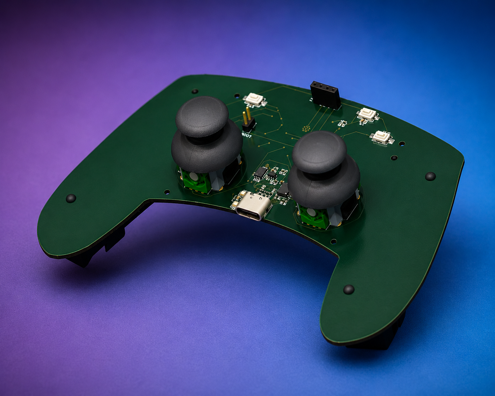
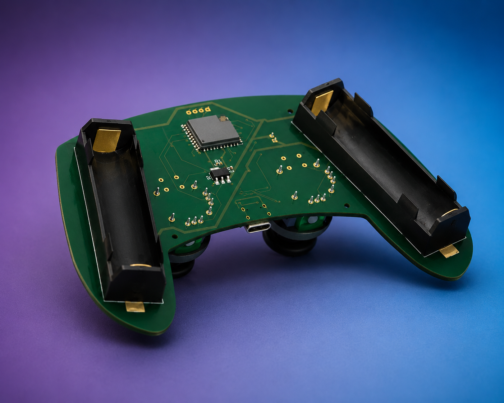

# J-Deck

<p align="center">
  <strong>An ESP32-C3 wireless controller for JATAYU and any Wi-Fi, Bluetooth, or ESP-NOW project.</strong><br />
  Compact in your hands. Fast on the link. Built to control.
</p>

<p align="center">
  <a href="#hardware"></a>
  <a href="#the-link"></a>
  <a href="#power"></a>
  
</p>



## Built for JATAYU. Ready for anything.

J-Deck is a purpose-built handheld wireless controller. Its primary role is to talk directly to the **JATAYU Flight Controller**, reading pilot inputs from twin analog joysticks and tactile controls before sending compact control data over **ESP-NOW**.

But it is not limited to flight. With its ESP32-C3 radio and programmable firmware, J-Deck can be adapted as a controller for robots, RC vehicles, smart-home projects, camera rigs, simulators, or any device that communicates through **Wi-Fi**, **Bluetooth Low Energy (BLE)**, or **ESP-NOW**.

No router is required for ESP-NOW. For other projects, choose the wireless mode and control protocol that best fits the device you are building.

> This repository contains the KiCad hardware design for the controller. Firmware, final protocol definitions, pin mappings, and flight-safety behaviour should be kept versioned alongside the matching JATAYU Flight Controller project.

## Wireless modes

| Mode | Great for | Typical connection |
| --- | --- | --- |
| ESP-NOW | Responsive device-to-device control, including JATAYU | Direct peer-to-peer packets; no access point required |
| Wi-Fi | Web dashboards, LAN-connected devices, and IoT projects | Connect through an access point or run a local access point |
| Bluetooth LE | Phones, tablets, and low-power nearby peripherals | BLE pairing and GATT services |

The controller hardware stays the same; the firmware defines the selected radio mode, packet format, mapping, and receiver behaviour.

## The link


```text
[J-Deck] -- ESP-NOW control packets --> [JATAYU Flight Controller]
[J-Deck] <-- optional telemetry ----- [JATAYU Flight Controller]
```

ESP-NOW is a strong fit for a dedicated RC link because it operates without a conventional Wi-Fi access point and keeps the radio exchange focused on the aircraft. The exact packet format, peer MAC addresses, update rate, channel, checksum, and failsafe timeout are firmware decisions - document them here when the flight stack is locked.

## Hardware



| Feature | Design choice |
| --- | --- |
| Brain | ESP32-C3-WROOM-02U - RISC-V MCU with 2.4 GHz radio |
| Flight controls | Two 2-axis analog joysticks |
| Extra input | Four tactile push buttons |
| Charging | USB-C input with TP4056 single-cell LiPo charger |
| Battery protection | DW01A + FS8205A protection stage |
| Regulation | AP2114H 3.3 V LDO |
| Feedback | Charge/status LEDs |

## Power

The controller is designed around a **single-cell 3.7 V LiPo battery**. USB-C feeds the onboard charger, while the battery protection circuit guards against over-charge, over-discharge, and over-current conditions. The 3.3 V regulator supplies the ESP32-C3 and controls.

**Treat lithium batteries with care:** use a protected, suitable 1S cell; inspect wiring and polarity before power-up; and never leave charging unattended.

## Repository map

```text
JATAYU-Controller.kicad_pro   KiCad project
JATAYU-Controller.kicad_sch   Schematic
JATAYU-Controller.kicad_pcb   PCB layout
JATAYU-Controller-BOM.csv     Bill of materials
GERBER/                       Manufacturing outputs
3D Files/                     Mechanical / enclosure assets
```

## Getting started

1. Open `JATAYU-Controller.kicad_pro` in KiCad.
2. Review the schematic, footprints, board rules, and antenna keep-out before ordering.
3. Generate fresh manufacturing files from the validated board revision.
4. Assemble and bring up the power rails first, then program and test the ESP-NOW firmware with the JATAYU Flight Controller.
5. Validate radio range, packet loss, neutral-stick calibration, arming logic, and failsafe behaviour **with props removed** before any flight test.

## Flight safety

This is an experimental flight-control device. A radio link must never be the only safety layer. The aircraft firmware should implement a conservative failsafe when packets stop arriving, reject malformed packets, require deliberate arming, and be tested in a controlled environment. Always follow applicable local regulations.

## Image checklist

The three placeholder images above are ready to be replaced with your own project shots:

1. A clean, assembled-controller hero photo.
2. An ESP-NOW architecture, telemetry, or range-test graphic.
3. A KiCad 3D render or close-up PCB photo.

---

<p align="center">Made for the <strong>JATAYU</strong> flight platform.</p>
